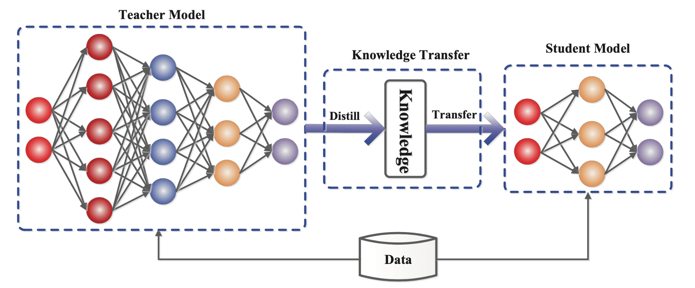
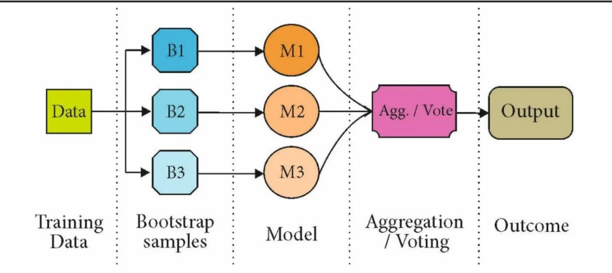
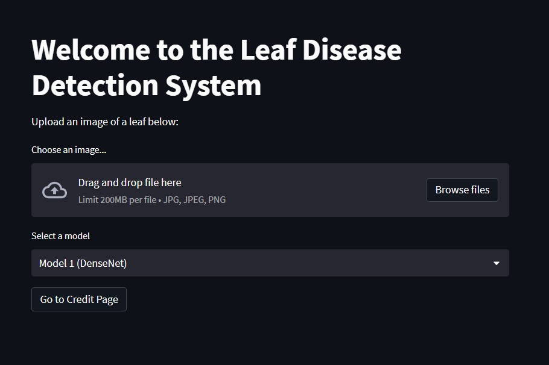
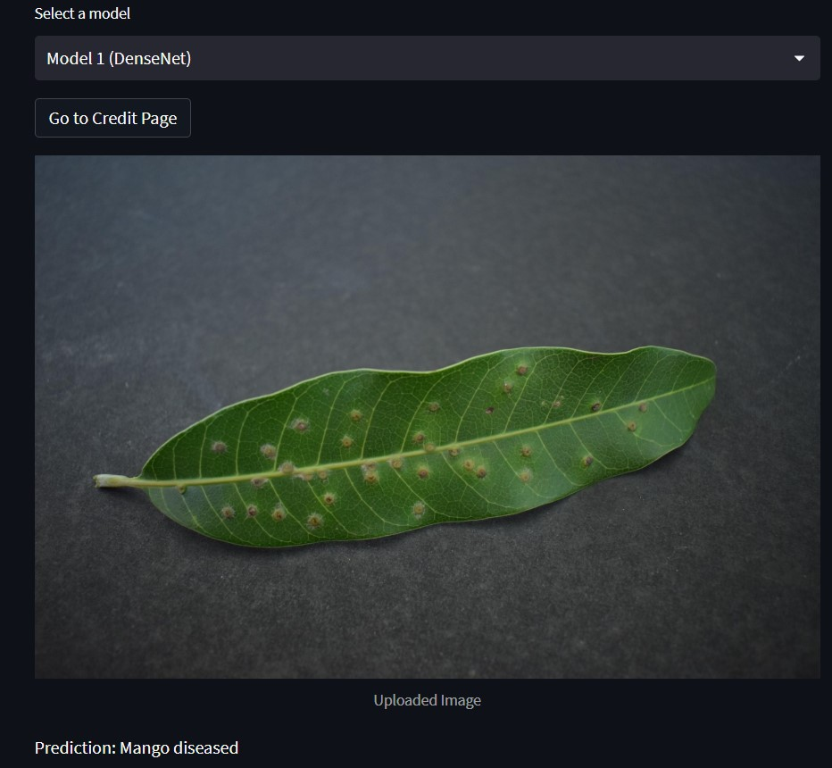
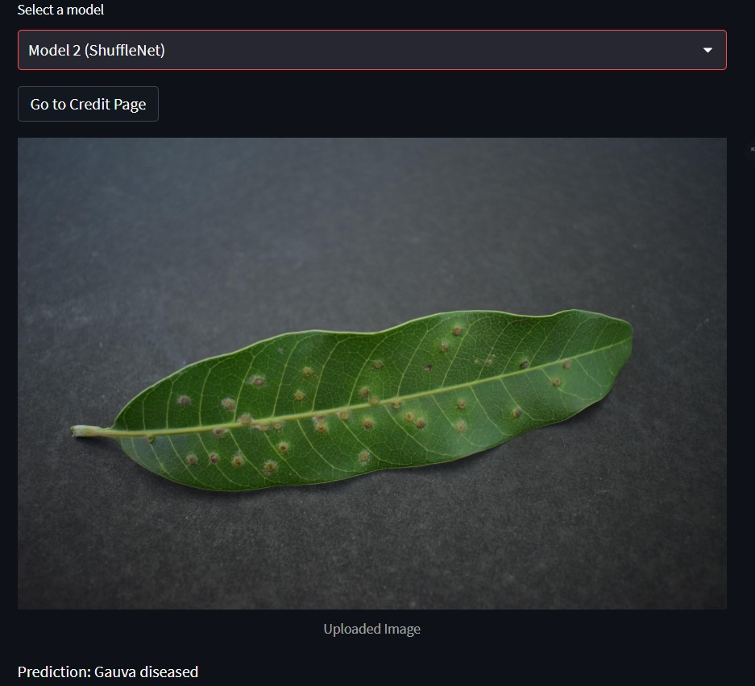
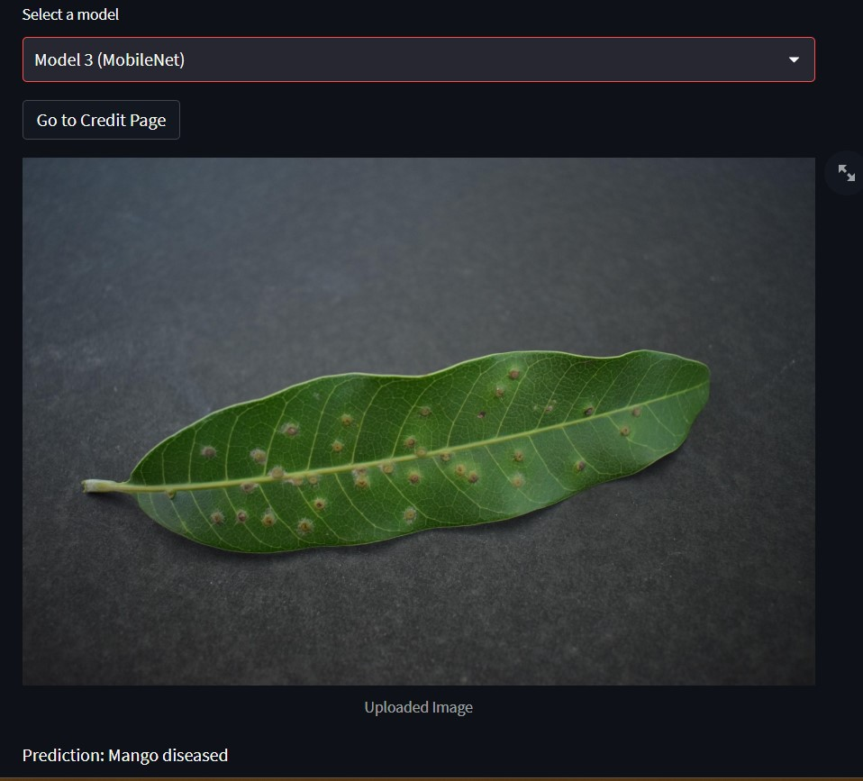
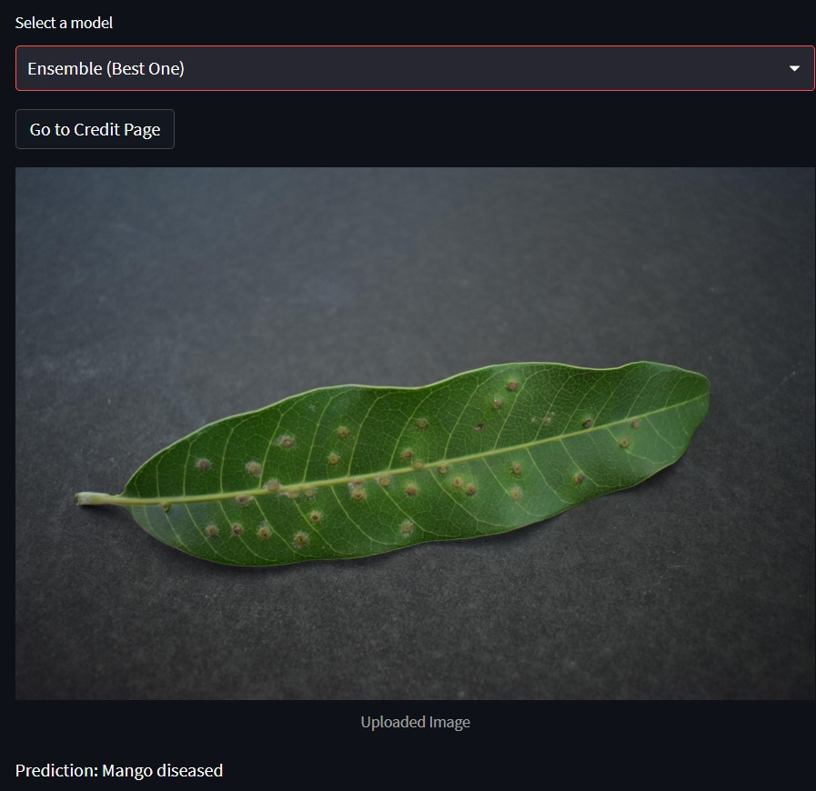

# DL-OPS Project

# Developing a system for Leaf Disease Detection 

Link for Demonstration: https://shilajit77-leaf2-trying-cy1r0u.streamlit.app/

Name of Students:
1. Shilajit Banerjee(M22CS062)
2. Dattatreyo Roy(M22CS060)

## Overview

The main objective of this project is proposing a system for detecting leaf diseases using different deep learning models. The system utilizes deep learning models to classify images of leaves into healthy or diseased categories and identify their diseases. To improve the accuracy, precision, and recall of the system, you have employed the concepts of knowledge distillation and ensemble learning. Knowledge distillation involves transferring the knowledge of a large, accurate model to a smaller model, allowing the smaller model to learn from the large model's predictions. This approach can improve the accuracy of the smaller model while reducing the computational resources required. Ensemble learning involves combining multiple models' predictions to obtain a more accurate prediction. This approach can improve the system's overall accuracy, precision, and recall by taking advantage of each model's strengths and weaknesses.
Your system includes an interface that allows users to select different models to detect leaf diseases. The results demonstrate that the ensembled model achieves comparable accuracy, precision, and recall to the larger teacher model while requiring less computational resources and time. 

## Objectives

1. Developing a leaf disease detection system using deep learning models: The main objective of the project is to develop a system that can accurately detect leaf diseases using deep learning models. This would involve training the models on a large dataset of images of healthy and diseased leaves.

2. Improving the accuracy, precision, and recall of the detection system through the knowlegde Distillation and Ensemble learning which can help improve the overall performance of the system by combining the predictions of multiple models.

   
 

3. Comparing the performance of the ensembled model to the teacher model and the models obtained by knowledge distillation where we aim to compare the performance of the ensembled model to determine whether the ensemble approach is more effective in improving the performance of the detection system.

   
 

 
 
4. The project aims to develop a user-friendly interface that allows users to choose different models for detecting diseases, providing flexibility and ease of use. This would involve designing and implementing an interface that is intuitive and easy to navigate.

## Dataset

We have taken the dayaset from Kaggle. The plant leaves dataset on Kaggle consists of 4,503 images of 12 plant species, namely Mango, Arjun, Alstonia Scholaris, Guava, Bael, Jamun, Jatropha, Pongamia Pinnata, Basil, Pomegranate, Lemon, and Chinar. The images have been labeled into two classes - healthy and diseased. The plants were named from P0 to P11 and the dataset was divided into 22 subject categories ranging from 0000 to 0022. The images labeled with categories 0000 to 0011 represent the healthy class, while those labeled with categories 0012 to 0022 represent the diseased class.
The dataset contains 2,278 images of healthy leaves and 2,225 images of diseased leaves. 
Follow this link to get an overview of the dataset:

## Approach to the problem:

In this project, we have developed the leaf disease detection system using three well-known deep learning models such as DenseNet121, ResNet101, and VGG16, to classify images of leaves into healthy or diseased categories and identify the specific disease. Having experimented with the individual models, we have found out the results. Now, to improving the accuracy, precision, and recall of the detection system, we have tried to use the Ensemble learning which can help improve the overall performance of the system by combining the predictions of multiple models.

   
 

 
## Interface

we have developed the user-friendly interface for this system which allows the users to choose different models for detecting diseases, providing flexibility and ease of use. This would involve designing and implementing an interface that is intuitive and easy to navigate. The users takes a look at the different diseases. Now, if they select any model and enter the leaf image with disease, it will show the detected label for that leaf.

   
 

 
 
 <table>
  <tr>
    <td></td>
    <td></td>
    <td></td>
  </tr>
</table>

   
 

## Results

Performance metrics of the used models:

| Model         | Accuracy | Precision | Recall | F1 Score |
| -------------| --------| --------- | ------ | -------- |
| DenseNet 121  | 0.88    | 0.91      | 0.88   | 0.88     |
| MobileNet     | 0.79    | 0.80      | 0.80   | 0.80     |
| ShuffleNet         | 0.78    | 0.81      | 0.79   | 0.79     |
| Ensemble Model    | 0.90    | 0.91      | 0.90   | 0.90     |

## Conclusion
